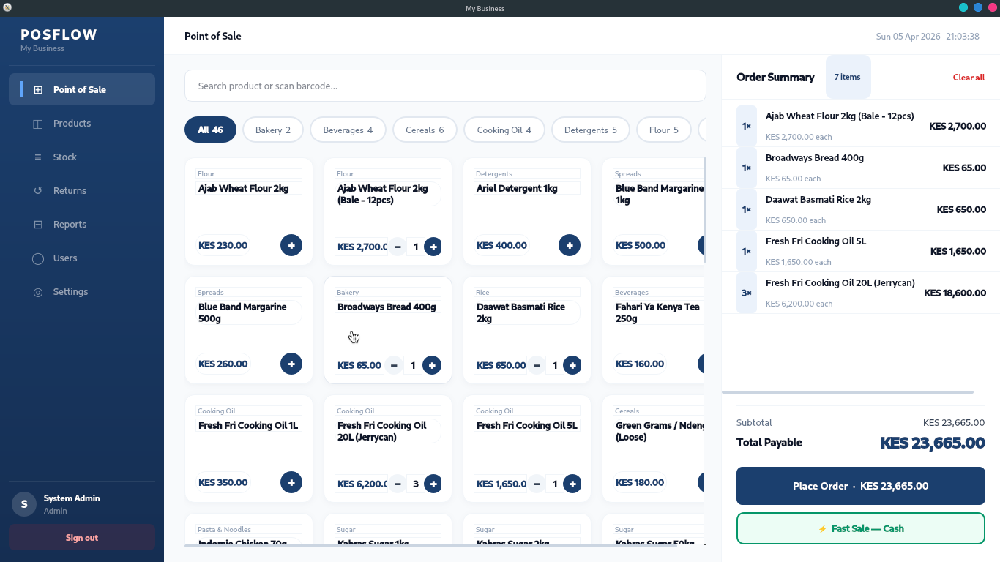
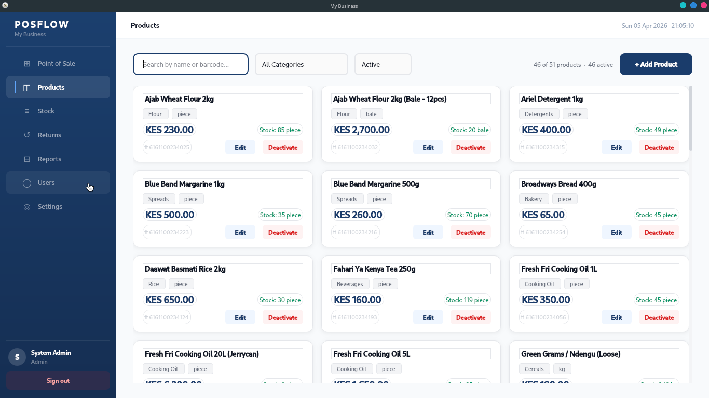

### PosFlow

A lightweight desktop Point of Sale system built for Kenyan retail and wholesale shops.
Built with Python, Tkinter, and SQLite, runs fully offline, no internet required.


### Screenshots






### Features

- **Sales** — process transactions quickly with product search and quantity input
- **Products** — add, edit, and manage your product catalogue with categories and pricing
- **Stock Management** — track stock levels and log stock movements
- **Returns** — handle customer returns and update inventory automatically
- **Reports** — view sales summaries and business performance
- **User Management** — role-based access control for staff and admin accounts
- **Receipt Generation** — auto-generate PDF receipts per transaction
- **Settings** — configure shop name, receipt details, and system preferences


### Tech Stack

- Python 3.13
- Tkinter (GUI)
- SQLAlchemy (ORM)
- Alembic (database migrations)
- SQLite (local database)
- ReportLab (PDF receipts)


### Getting Started

**Clone the repo**
```bash
git clone https://github.com/ianmuriuki/POSflow.git
cd POSflow
```

**Create and activate a virtual environment**
```bash
python -m venv venv
source venv/bin/activate
```

**Install dependencies**
```bash
pip install -r requirements.txt
```

**Run migrations**
```bash
alembic upgrade head
```

**Seed sample products (optional)**
```bash
python scripts/seed_products.py
```

**Launch the app**
```bash
python main.py
```

